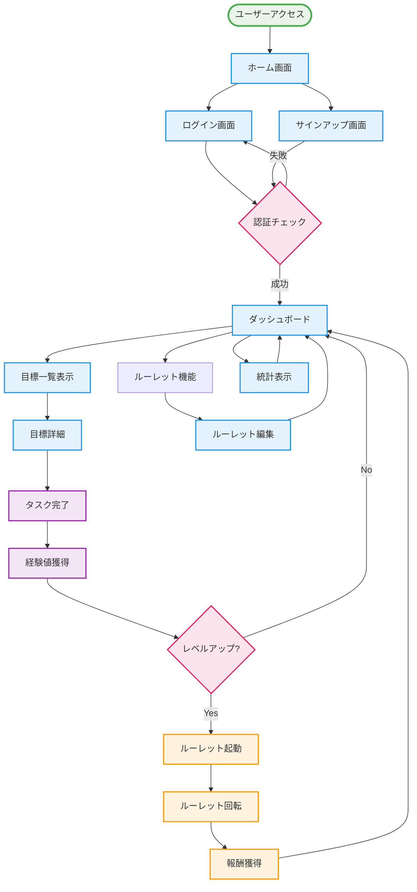
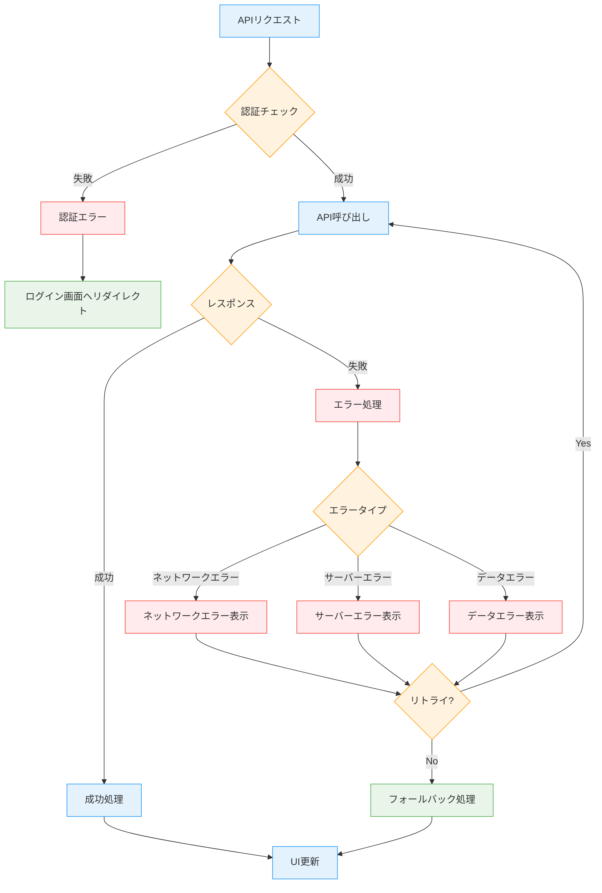

# Plus ONE 詳細画面遷移図

## ユーザーフロー図



## データフロー図

```mermaid
flowchart LR
    subgraph "フロントエンド"
        UI[ユーザーインターフェース]
        State[状態管理]
        Router[ルーティング]
    end
    
    subgraph "認証"
        Auth[Amplify Auth]
        Token[認証トークン]
    end
    
    subgraph "API"
        API[API Gateway]
        Lambda[Lambda Functions]
    end
    
    subgraph "データベース"
        DB[(DynamoDB)]
        Goals[目標データ]
        Users[ユーザーデータ]
        Roulette[ルーレットデータ]
    end
    
    UI --> Router
    Router --> State
    State --> Auth
    Auth --> Token
    Token --> API
    API --> Lambda
    Lambda --> DB
    DB --> Goals
    DB --> Users
    DB --> Roulette
    
    Goals --> Lambda
    Users --> Lambda
    Roulette --> Lambda
    Lambda --> API
    API --> State
    State --> UI
```

## コンポーネント関係図

```mermaid
graph TB
    subgraph "ページコンポーネント"
        Index[Home/index.js]
        Dashboard[Dashboard/dashboard.js]
        GoalDetail[GoalDetail/goals/[goalId].js]
        Login[Auth/login.js]
    end
    
    subgraph "共通コンポーネント"
        Layout[Layout.js]
        Header[Header.js]
        Footer[Footer.js]
        Modal[Modal.js]
    end
    
    subgraph "機能コンポーネント"
        Calendar[Calendar.js]
        Chart[ExpLineChart.js]
        Roulette[RoulettePopup.js]
    end
    
    subgraph "編集コンポーネント"
        EditGoal[EditGoal.js]
        CreateGoal[CreateGoal.js]
        EditSmallGoal[EditSmallGoal.js]
    end
    
    subgraph "コンテキスト"
        GoalsContext[GoalsContext.js]
        TicketsContext[TicketsContext.js]
    end
    
    Index --> Layout
    Dashboard --> Layout
    GoalDetail --> Layout
    Login --> Layout
    
    Layout --> Header
    Layout --> Footer
    
    Dashboard --> Calendar
    Dashboard --> Chart
    Dashboard --> Roulette
    Dashboard --> EditGoal
    Dashboard --> CreateGoal
    
    GoalDetail --> EditGoal
    GoalDetail --> EditSmallGoal
    
    Dashboard --> GoalsContext
    Dashboard --> TicketsContext
    GoalDetail --> GoalsContext
    Roulette --> TicketsContext
    
    EditGoal --> Modal
    CreateGoal --> Modal
    EditSmallGoal --> Modal
    Roulette --> Modal
```

## エラーハンドリングフロー

